

  
# TPMSGenerator
  

 

<!-- 逆向设计 -->
* ## 🧭 **_Display of generated results_**

  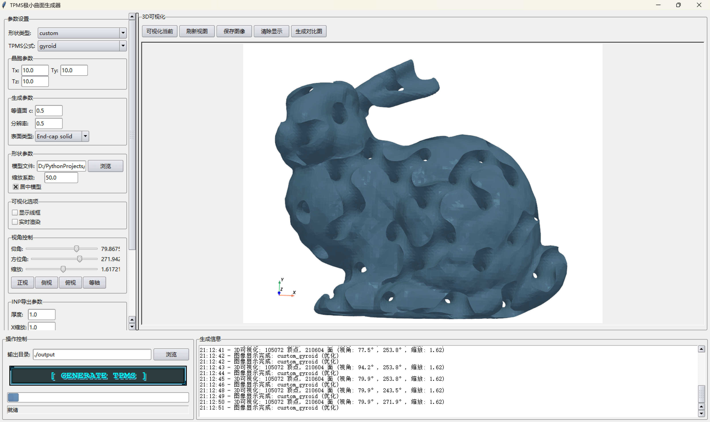   
  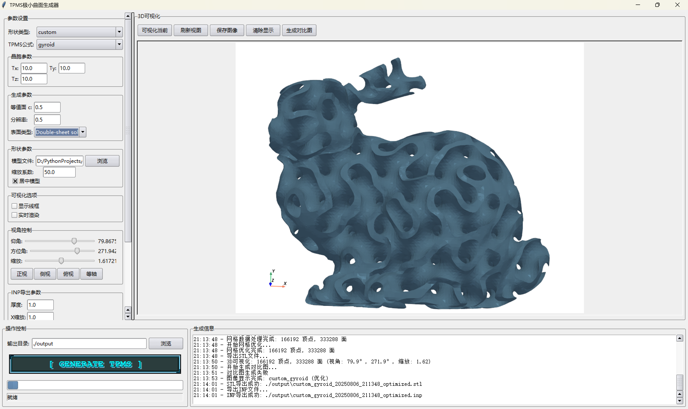   
  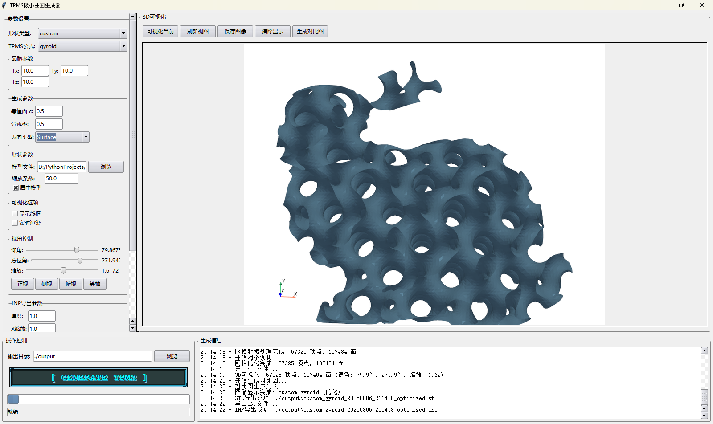
    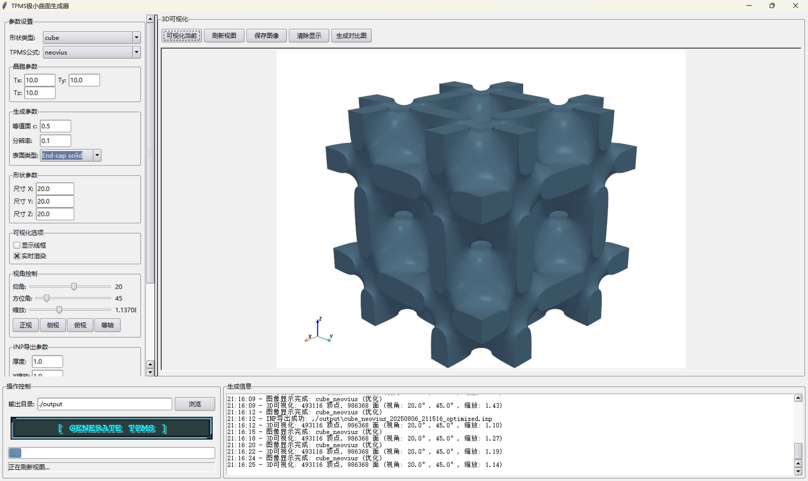   
  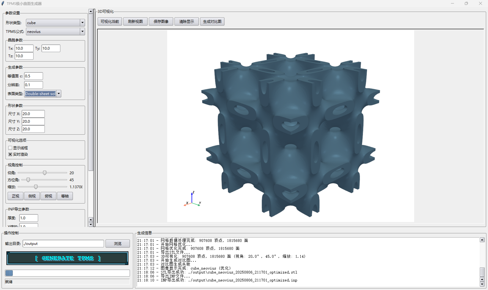   
  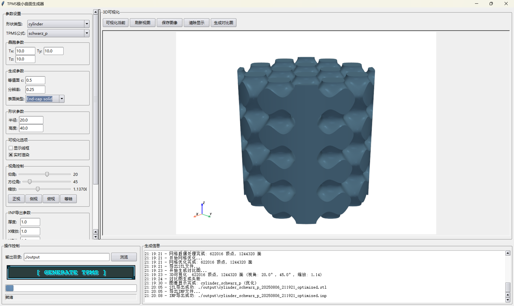
       
  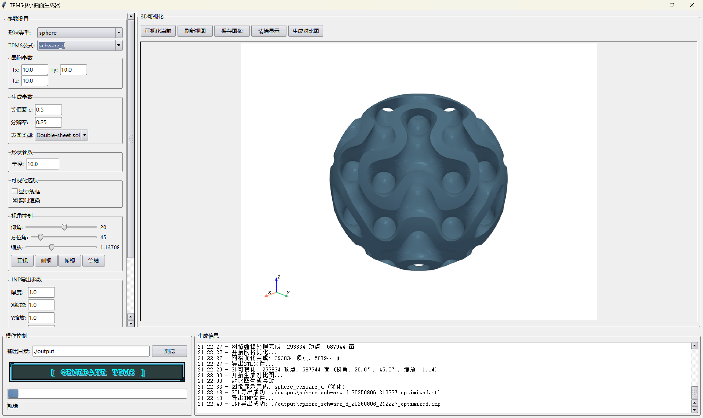   
  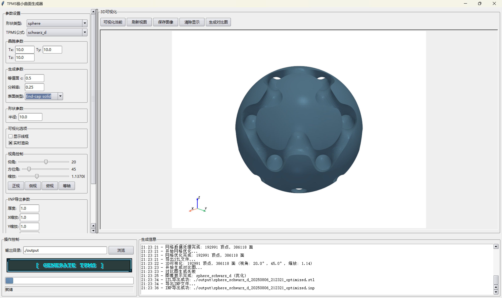
    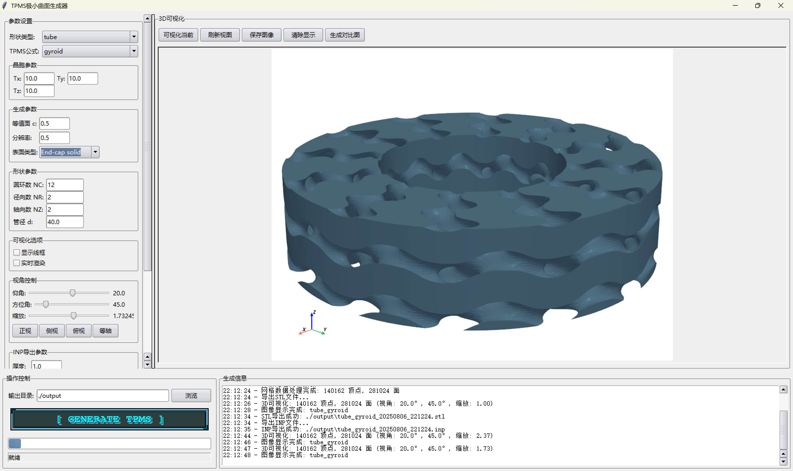   
  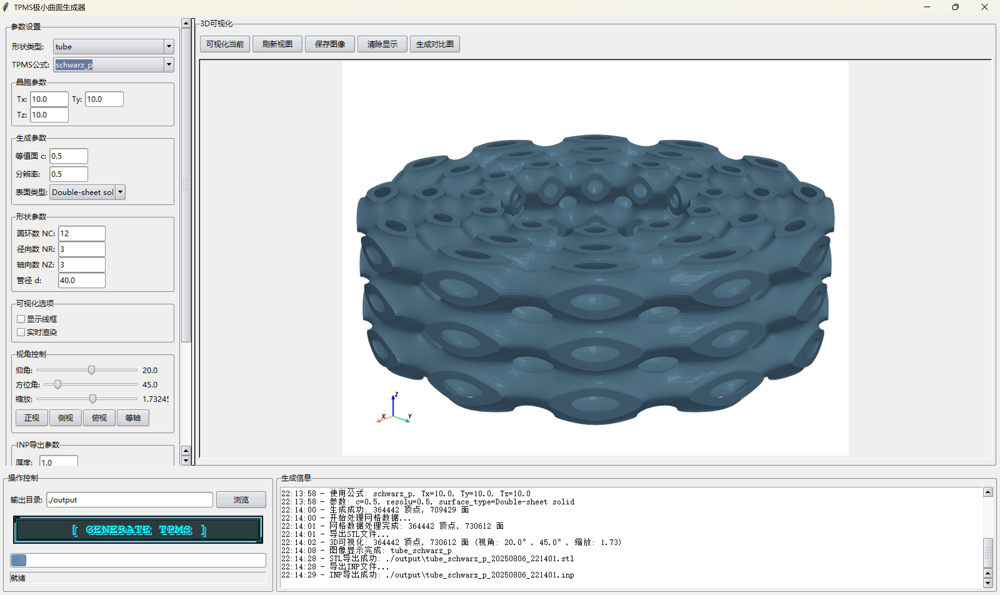   
    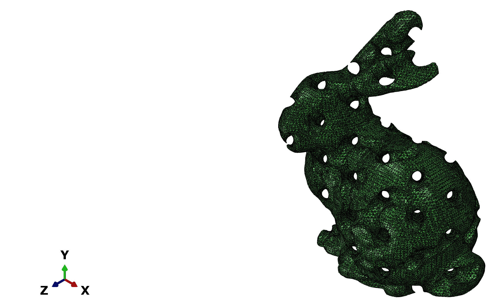
    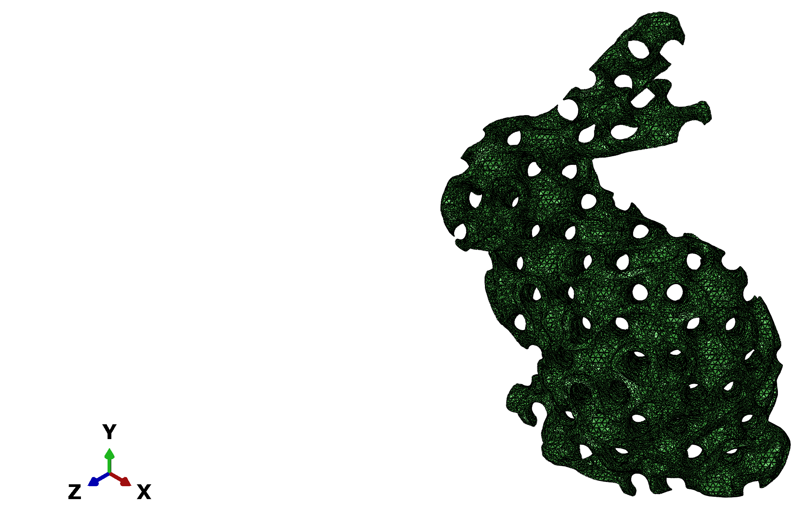   
  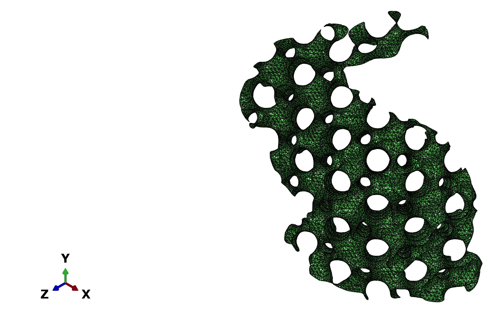  
   
<strong>Fig. 1. The generations of TPMS generator</strong>

     
